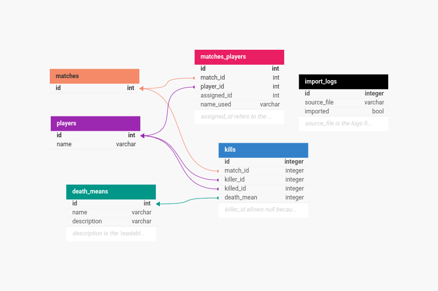

# Quake 3 Arena Log Parser

## Overview

This project is a Ruby on Rails application designed to parse Quake 3 Arena log files, extracting and organizing data related to matches, players, and kills. The application generates detailed reports for each match, including player rankings, death causes, and a readable kill log. It also features sections dedicated to players' total kills and comprehensive information about the means of death and their total occurrences.

## Features

- **Log Parsing**: Reads and processes Quake 3 Arena log files, grouping game data by match.
- **Kill Data Collection**: Accurately collects and computes kill data, considering special rules for world kills (when `<world>` kills a player, that player loses 1 kill from their score).
- **Reports**: Generates comprehensive reports for each match, including:
    - Total kills
    - Player rankings
    - Death causes
    - Detailed kill descriptions

## Getting Started

### Prerequisites

- Ruby `3.1.2`
- Rails `7.2.1`
- SQLite3 (or another configured database)
- Bundler

### Installation

1. Clone the repository:
    
    ```bash
    git clone https://github.com/julianesilvac75/quake3-arena-log-parser.git
    cd quake3-arena-log-parser
    ```
    
2. Install dependencies:
    
    ```bash
    bundle install
    ```
    
3. Set up the database:
    
    ```bash
    bin/rails db:create db:migrate
    ```
    
4. Run the application:
    
    ```bash
    bin/rails server
    ```

### Usage

1. Access the application at [`http://127.0.0.1:3000`](http://127.0.0.1:3000) or [`http://localhost:3000/`](http://localhost:3000/) in your browser.
2. The Home page provides links to the Matches, Players, and Means of Death sections. Here’s a brief guide to the available pages and their contents:
    - **Matches:** Displays the total number of registered matches and links to individual match pages.
        - **Match page:** Provides information about players’ names, the total number of kills in the match, a Kills by Means section detailing how each death occurred, and a summary of kills per player (considering the special rule for `<world>` kills). You can also click on **See Kill Log** to view a detailed list of each kill.
    - **Players:** Lists all registered players and their total kills across all matches.
    - **Means of Death:** Lists all registered means of death and their total occurrences across all matches.

### Testing

Run the test suite using:

```bash
bin/rails test
```

## Project Structure

- `app/controller`: Contains the controllers for `DeathMean`, `Errors`, `Log`, `Match`, and `Player`.
- `app/models`: Contains the models for `DeathMean`, `ImportLog`, `Kill`, `Match`, `MatchesPlayer`, and `Player`.
- `app/services`: Contains the logic for kill handling, kill calculation, log parsing, and log importing.
- `db/migrate`: Database migrations for setting up the schema.
- `lib/assets/qgames.log`: Quake 3 Arena log file.
- `test/`: Unit and integration tests for the application.

## Design Decisions

- One of the first decisions made was regarding the database structure, designed to be simple and avoid data redundancy. Below is an overview of the database structure:
    
    
    
    Key points about certain tables:
    
    - `import_logs`: `source_file` is the path to the log file to be imported into the database and must be unique to prevent duplicate imports; `imported` tracks whether the log file has already been imported.
    - `matches_players`: `assigned_id` refers to the ID each player receives when entering a match; `name_used` refers to the name the player chooses during the match, preventing duplications in the players table.
    - `death_means`: `description` is the readable text used to generate kill logs.
    - `kills`: `killer_id` allows `null` because `<world>` is not a player but can still kill players.
- **Importing Log Data**: The logic processes the log file line by line, filtering out irrelevant lines. It then determines whether a line pertains to a match starting, a player's information being changed, or a kill, and applies the appropriate logic to parse and store the correct information in the database.
    
    The initial design of this logic was sketched out before coding began, and you can see how it looked then [here](https://drive.google.com/file/d/11bg6zRofrDPt-l2WPCfVoZfxzhRzE2i4/view?usp=sharing) (the file is in Portuguese and still to be translated to English).
    
    The parser processes the log file line by line to optimize memory usage.

## Future Improvements

- Enhance the web interface design to be more user-friendly and visually appealing.
- Implement more detailed reports on players and means of death rankings.
